# 🎓 College Academic Knowledge Base & Engineering Project Portfolio

[](curriculum/curriculum-map.md)
[](docs/progress.md)
[](curriculum/academic-roadmap.md)
[](LICENSE)

> **A structured academic portfolio containing university coursework, software engineering projects, practical implementations, technical notes, references, and programming assignments.**

---

## 👨‍💻 Engineer & Portfolio Identity

* **Author:** **Ahmed Fawzy**
* **Institution:** Future Academy — Higher Institute for Management & Information Technology, School of Computer Science
* **Degree:** Bachelor of Science in Computer Science (B.Sc. CS)
* **Total Academic Volume:** **142 Credit Hours** across **50 Courses** (8 Semesters + Continuous Capstone)
* **Repository Architecture:** Long-term academic knowledge base, course dependency graph, verified assignments, runnable engineering implementations, and capstone software architecture.

---

## 🧠 Core Philosophy & Traceability

This repository is **not** a loose collection of homework files. It is a **rigorous, structured representation of an entire academic software engineering journey**.

Every course across the 4-year curriculum demonstrates end-to-end academic traceability:

```text
University Curriculum (142 Credit Hours)
        ↓
Course Code & Name (e.g., CS211 Data Structures)
        ↓
Formal Prerequisites (CS111 C++, CS112 Java)
        ↓
Curriculum Topics (Trees, Heaps, Hash Tables)
        ↓
Authoritative Textbook (Mark Allen Weiss, 4th Ed.)
        ↓
Book Chapter (Chapter 4: Trees, Chapter 5: Hashing)
        ↓
Lecture Sessions (Sessions 01 – 12)
        ↓
Applied Laboratory (Labs 01 – 04)
        ↓
Graded University Assignment (Problem Statement & Solutions)
        ↓
Real-World Engineering Project (Task Management & Priority Queue Engine)
        ↓
Runnable Implementation & Automated Test Suite
```

---

## 🗺️ Master Curriculum Matrix (50 Courses / 142 Credit Hours)

| # | Code | Course Title | Term | Credits | Category | Primary Tech | Engineering Project | Status |
|:---:|:---:|---|:---:|:---:|---|---|---|:---:|
| 01 | `CS101` | **[Introduction to Computer](courses/01-cs101-introduction-to-computer/README.md)** | Y1S1 | 3 Cr | Core CS | `CLI, PowerShell` | [System Information & Resource Inspector CLI](courses/01-cs101-introduction-to-computer/projects/README.md) | ✅ Complete |
| 02 | `CS112` | **[Java Programming](courses/02-cs112-java-programming/README.md)** | Y1S1 | 3 Cr | Core CS | `Java 11+, JUnit 5` | [Credit Card & Financial Transaction Validation Engine](courses/02-cs112-java-programming/projects/README.md) | ✅ Complete |
| 03 | `HU101` | **[Technical English 1](courses/03-hu101-technical-english-1/README.md)** | Y1S1 | 2 Cr | Humanities | `Markdown, LaTeX` | [Technical Documentation & Specification Portfolio](courses/03-hu101-technical-english-1/projects/README.md) | ✅ Complete |
| 04 | `HU104` | **[Principles of Management](courses/04-hu104-principles-of-management/README.md)** | Y1S1 | 2 Cr | Business | `Trello, Agile Management` | [Engineering Team Organizational & Governance Model](courses/04-hu104-principles-of-management/projects/README.md) | ✅ Complete |
| 05 | `MA101` | **[Mathematics 1](courses/05-ma101-mathematics-1/README.md)** | Y1S1 | 3 Cr | Basic Science | `Python, SymPy` | [Numerical Differentiation & Integration Engine](courses/05-ma101-mathematics-1/projects/README.md) | ✅ Complete |
| 06 | `PH101` | **[General Physics](courses/06-ph101-general-physics/README.md)** | Y1S1 | 3 Cr | Basic Science | `Python, SciPy` | [Electric Field & DC Circuit Numerical Simulator](courses/06-ph101-general-physics/projects/README.md) | ✅ Complete |
| 07 | `CS111` | **[Programming Language 1 (C++)](courses/07-cs111-programming-language-1-cpp/README.md)** | Y1S2 | 3 Cr | Core CS | `C++17, GCC / Clang` | [Personal Expense Tracker & Financial CLI](courses/07-cs111-programming-language-1-cpp/projects/README.md) | ✅ Complete |
| 08 | `EL101` | **[Computer Electronics](courses/08-el101-computer-electronics/README.md)** | Y1S2 | 3 Cr | Systems | `SPICE, Proteus` | [Analog Circuit & Logic Gate Analysis Simulator](courses/08-el101-computer-electronics/projects/README.md) | ✅ Complete |
| 09 | `HU102` | **[Technical English 2](courses/09-hu102-technical-english-2/README.md)** | Y1S2 | 2 Cr | Humanities | `Markdown, Pandoc` | [Software Engineering Whitepaper & Specification Review](courses/09-hu102-technical-english-2/projects/README.md) | ✅ Complete |
| 10 | `HU103` | **[Principles of Economics](courses/10-hu103-principles-of-economics/README.md)** | Y1S2 | 2 Cr | Humanities | `Python, Pandas` | [Market Equilibrium & SaaS Pricing Optimization Engine](courses/10-hu103-principles-of-economics/projects/README.md) | ✅ Complete |
| 11 | `IS101` | **[Information Systems Fundamentals](courses/11-is101-information-systems-fundamentals/README.md)** | Y1S2 | 3 Cr | Information Systems | `UML, BPMN` | [Enterprise Information Architecture Blueprint](courses/11-is101-information-systems-fundamentals/projects/README.md) | ✅ Complete |
| 12 | `ST101` | **[Probability & Statistics](courses/12-st101-probability-and-statistics/README.md)** | Y1S2 | 3 Cr | Basic Science | `Python, SciPy` | [Statistical Distribution & Hypothesis Testing Analyzer](courses/12-st101-probability-and-statistics/projects/README.md) | ✅ Complete |
| 13 | `CS201` | **[Discrete Structures](courses/13-cs201-discrete-structures/README.md)** | Y2S1 | 3 Cr | Core CS | `Python, NetworkX` | [Propositional Logic Solver & Graph Relations Engine](courses/13-cs201-discrete-structures/projects/README.md) | ✅ Complete |
| 14 | `CS211` | **[Data Structures](courses/14-cs211-data-structures/README.md)** | Y2S1 | 3 Cr | Core CS | `C++17, Java` | [High-Performance Task Management & Priority Queue Engine](courses/14-cs211-data-structures/projects/README.md) | ✅ Complete |
| 15 | `CS212` | **[Programming Language 2 (OOP)](courses/15-cs212-programming-language-2-oop/README.md)** | Y2S1 | 3 Cr | Core CS | `C++17, UML` | [Object-Oriented University Library Management System](courses/15-cs212-programming-language-2-oop/projects/README.md) | ✅ Complete |
| 16 | `CS221` | **[Digital Logic Design](courses/16-cs221-digital-logic-design/README.md)** | Y2S1 | 3 Cr | Systems | `Verilog, Logisim` | [4-Bit Arithmetic Logic Unit & FSM Digital Simulator](courses/16-cs221-digital-logic-design/projects/README.md) | ✅ Complete |
| 17 | `HU202` | **[Business Law & Ethics](courses/17-hu202-business-law-and-ethics/README.md)** | Y2S1 | 2 Cr | Humanities | `License Auditing, Compliance Checklists` | [Software Licensing & Data Privacy Compliance Auditor](courses/17-hu202-business-law-and-ethics/projects/README.md) | ✅ Complete |
| 18 | `MA202` | **[Mathematics 2](courses/18-ma202-mathematics-2/README.md)** | Y2S1 | 3 Cr | Basic Science | `Python, NumPy` | [Linear Algebra Matrix Operations & Decomposition Library](courses/18-ma202-mathematics-2/projects/README.md) | ✅ Complete |
| 19 | `CS213` | **[Design & Analysis of Algorithms](courses/19-cs213-design-and-analysis-of-algorithms/README.md)** | Y2S2 | 3 Cr | Core CS | `C++17, Python` | [Route Optimization & Graph Algorithm Visualizer Engine](courses/19-cs213-design-and-analysis-of-algorithms/projects/README.md) | ✅ Complete |
| 20 | `CS214` | **[Visual Programming (C#)](courses/20-cs214-visual-programming-csharp/README.md)** | Y2S2 | 3 Cr | Applied CS | `C#, .NET Core / .NET 6+` | [Desktop University Student & Grade Management System](courses/20-cs214-visual-programming-csharp/projects/README.md) | ✅ Complete |
| 21 | `CS222` | **[Computer Architecture & Organization](courses/21-cs222-computer-architecture-and-organization/README.md)** | Y2S2 | 3 Cr | Systems | `MIPS Assembly, MARS Simulator` | [MIPS Instruction Set CPU Emulator & Cache Simulator](courses/21-cs222-computer-architecture-and-organization/projects/README.md) | ✅ Complete |
| 22 | `HU201` | **[Principles of Accounting](courses/22-hu201-principles-of-accounting/README.md)** | Y2S2 | 2 Cr | Business | `Python, SQL` | [Double-Entry Ledger & Financial Statement Generator](courses/22-hu201-principles-of-accounting/projects/README.md) | ✅ Complete |
| 23 | `IS211` | **[Database Systems 1](courses/23-is211-database-systems-1/README.md)** | Y2S2 | 3 Cr | Information Systems | `PostgreSQL, MySQL` | [University Academic Management Relational Database](courses/23-is211-database-systems-1/projects/README.md) | ✅ Complete |
| 24 | `CS311` | **[Automata & Formal Languages](courses/24-cs311-automata-and-formal-languages/README.md)** | Y3S1 | 3 Cr | Theoretical CS | `Python, JFLAP` | [Finite State Automata & Regular Expression Engine](courses/24-cs311-automata-and-formal-languages/projects/README.md) | ✅ Complete |
| 25 | `CS313` | **[Web Programming](courses/25-cs313-web-programming/README.md)** | Y3S1 | 3 Cr | Applied CS | `HTML5, CSS3` | [Interactive Academic Web Portal & Student Dashboard](courses/25-cs313-web-programming/projects/README.md) | ✅ Complete |
| 26 | `CS314` | **[Python Programming](courses/26-cs314-python-programming/README.md)** | Y3S1 | 3 Cr | Applied CS | `Python 3.10+, Pytest` | [Automated Data Processing & Web Scraping Pipeline](courses/26-cs314-python-programming/projects/README.md) | ✅ Complete |
| 27 | `CS331` | **[Computer Networks 1](courses/27-cs331-computer-networks-1/README.md)** | Y3S1 | 3 Cr | Infrastructure | `Python Sockets, Wireshark` | [Concurrent Multi-Client Server Messaging System](courses/27-cs331-computer-networks-1/projects/README.md) | ✅ Complete |
| 28 | `CSC312` | **[System Programming](courses/28-csc312-system-programming/README.md)** | Y3S1 | 3 Cr | Systems | `C, GCC` | [Two-Pass Assembler & Unix Shell Implementation](courses/28-csc312-system-programming/projects/README.md) | ✅ Complete |
| 29 | `IS321` | **[Project Management](courses/29-is321-project-management/README.md)** | Y3S1 | 2 Cr | Business | `Jira, MS Project` | [Software Engineering Project Management Plan & WBS Suite](courses/29-is321-project-management/projects/README.md) | ✅ Complete |
| 30 | `MA301` | **[Operations Research](courses/30-ma301-operations-research/README.md)** | Y3S1 | 3 Cr | Basic Science | `Python, PuLP` | [Linear Programming Simplex Solver & Optimization Toolkit](courses/30-ma301-operations-research/projects/README.md) | ✅ Complete |
| 31 | `CS321` | **[Operating Systems](courses/31-cs321-operating-systems/README.md)** | Y3S2 | 3 Cr | Systems | `C++, C` | [Process Scheduling & Page Replacement Simulator](courses/31-cs321-operating-systems/projects/README.md) | ✅ Complete |
| 32 | `CS341` | **[Computer Graphics](courses/32-cs341-computer-graphics/README.md)** | Y3S2 | 3 Cr | Applied CS | `C++, OpenGL / GLUT` | [2D/3D Rasterization Engine & Transformation Suite](courses/32-cs341-computer-graphics/projects/README.md) | ✅ Complete |
| 33 | `HU301` | **[Technical Report Writing](courses/33-hu301-technical-report-writing/README.md)** | Y3S2 | 2 Cr | Humanities | `LaTeX, Markdown` | [Standardized Technical Research Report & IEEE Paper Blueprint](courses/33-hu301-technical-report-writing/projects/README.md) | ✅ Complete |
| 34 | `HU302` | **[Principles of Marketing](courses/34-hu302-principles-of-marketing/README.md)** | Y3S2 | 2 Cr | Business | `Google Analytics, Marketing Funnels` | [Tech Startup Go-To-Market & Digital Acquisition Strategy](courses/34-hu302-principles-of-marketing/projects/README.md) | ✅ Complete |
| 35 | `IS312` | **[Database Systems 2](courses/35-is312-database-systems-2/README.md)** | Y3S2 | 3 Cr | Information Systems | `PostgreSQL, PL/pgSQL` | [ACID Transaction & High-Concurrency Banking Database Engine](courses/35-is312-database-systems-2/projects/README.md) | ✅ Complete |
| 36 | `IS331` | **[System Analysis & Design](courses/36-is331-system-analysis-and-design/README.md)** | Y3S2 | 3 Cr | Software Dev | `PlantUML, Mermaid.js` | [Enterprise Academic Management System Analysis & UML Blueprint](courses/36-is331-system-analysis-and-design/projects/README.md) | ✅ Complete |
| 37 | `MA302` | **[Mathematics 3](courses/37-ma302-mathematics-3/README.md)** | Y3S2 | 3 Cr | Basic Science | `Python, SciPy` | [Differential Equation Numerical Solver (Runge-Kutta & Euler)](courses/37-ma302-mathematics-3/projects/README.md) | ✅ Complete |
| 38 | `TR301` | **[Microsoft Office Skills Training](courses/38-tr301-microsoft-office-skills-training/README.md)** | Y3S2 | 2 Cr | Skills | `Excel, VBA` | [Automated Financial & Academic Reporting Dashboard](courses/38-tr301-microsoft-office-skills-training/projects/README.md) | ✅ Complete |
| 39 | `CS441` | **[Artificial Intelligence](courses/39-cs441-artificial-intelligence/README.md)** | Y4S1 | 3 Cr | AI & Data | `Python 3, Pytest` | [A* Pathfinding & Minimax Adversarial Game Engine](courses/39-cs441-artificial-intelligence/projects/README.md) | ✅ Complete |
| 40 | `CS451` | **[Information Security](courses/40-cs451-information-security/README.md)** | Y4S1 | 3 Cr | Security | `Python, Cryptography library` | [Cryptographic Suite & Secure Communication Engine](courses/40-cs451-information-security/projects/README.md) | ✅ Complete |
| 41 | `CS491` | **[Special Topics in Computer Science](courses/41-cs491-special-topics-in-computer-science/README.md)** | Y4S1 | 3 Cr | Advanced CS | `Docker, FastAPI` | [Containerized Microservices Architecture & CI/CD Pipeline](courses/41-cs491-special-topics-in-computer-science/projects/README.md) | ✅ Complete |
| 42 | `CSC465` | **[Software Engineering](courses/42-csc465-software-engineering/README.md)** | Y4S1 | 3 Cr | Software Dev | `UML, FastAPI / Python` | [Production-Grade Academic Service Architecture & TDD Suite](courses/42-csc465-software-engineering/projects/README.md) | ✅ Complete |
| 43 | `CSC466` | **[Data Mining](courses/43-csc466-data-mining/README.md)** | Y4S1 | 3 Cr | AI & Data | `Python, Scikit-Learn` | [Apriori Association Rule & K-Means Clustering Mining Pipeline](courses/43-csc466-data-mining/projects/README.md) | ✅ Complete |
| 44 | `CS415` | **[Mobile Application Development](courses/44-cs415-mobile-application-development/README.md)** | Y4S2 | 3 Cr | Mobile | `Flutter, Dart` | [Cross-Platform Smart Student Course & Schedule App](courses/44-cs415-mobile-application-development/projects/README.md) | ✅ Complete |
| 45 | `CS444` | **[Digital Image Processing 1](courses/45-cs444-digital-image-processing-1/README.md)** | Y4S2 | 3 Cr | AI & Data | `Python, OpenCV` | [Computer Vision Image Enhancement & Edge Detection Suite](courses/45-cs444-digital-image-processing-1/projects/README.md) | ✅ Complete |
| 46 | `CS445` | **[Digital Image Processing 2](courses/46-cs445-digital-image-processing-2/README.md)** | Y4S2 | 3 Cr | AI & Data | `Python, OpenCV` | [Fourier Transform Filtering & Otsu Image Segmentation Suite](courses/46-cs445-digital-image-processing-2/projects/README.md) | ✅ Complete |
| 47 | `CSC465-ML` | **[Machine Learning](courses/47-csc465-machine-learning/README.md)** | Y4S2 | 3 Cr | AI & Data | `Python, Scikit-Learn` | [End-to-End Machine Learning Model Training & Evaluation Pipeline](courses/47-csc465-machine-learning/projects/README.md) | ✅ Complete |
| 48 | `EE242` | **[Logic Design (Self Study)](courses/48-ee242-logic-design-self-study/README.md)** | Y4S2 | 3 Cr | Systems | `Verilog, Python Logic Synthesizer` | [Quine-McCluskey Boolean Minimizer & Digital Circuit Synthesizer](courses/48-ee242-logic-design-self-study/projects/README.md) | ✅ Complete |
| 49 | `HU401` | **[Creative Thinking & Innovation](courses/49-hu401-creative-thinking/README.md)** | Y4S2 | 2 Cr | Humanities | `Design Thinking, Brainstorming Frameworks` | [Design Thinking Innovation Canvas & Product Solution Blueprint](courses/49-hu401-creative-thinking/projects/README.md) | ✅ Complete |
| 50 | `CS499` | **[Graduation Project](courses/50-cs499-graduation-project/README.md)** | Y4S1-S2 | 6 Cr | Capstone | `Flutter, Dart` | [iLearn: Comprehensive Smart Educational Platform & Management Ecosystem](courses/50-cs499-graduation-project/projects/README.md) | ✅ Complete |

---

## 🌳 Dynamic & Interactive Course Dependency Tree

The interactive flowchart below maps out the complete prerequisite flow across all **50 courses** and **8 academic semesters**. 
Each course node is **color-coded by its academic domain** and is **clickable** — select any course node to navigate directly to its knowledge base and syllabus.

### 🎨 Academic Domain Legend
| Indicator | Academic Specialization | Representative Courses |
|:---:|---|---|
| 🟦 **Blue** | **Core CS & Programming** | `CS111` C++, `CS211` Data Structures, `CS213` Algorithms, `CS313` Web Dev |
| 🟧 **Amber** | **Systems & Hardware** | `EL101` Electronics, `CS221` Digital Logic, `CS222` Architecture, `CS321` OS |
| 🟪 **Purple** | **AI & Data Science** | `CS441` AI, `CSC466` Data Mining, `CS444` DIP 1, `CSC465-ML` Machine Learning |
| 🟩 **Emerald** | **Information Systems** | `IS101` IS Fundamentals, `IS211` DB 1, `IS312` DB 2, `IS331` System Analysis |
| 🟌 **Indigo** | **Mathematics & Basic Sciences** | `MA101` Calculus 1, `PH101` Physics, `ST101` Stats, `CS201` Discrete Math |
| 🟥 **Rose** | **Business & Economics** | `HU104` Management, `HU103` Economics, `HU201` Accounting, `IS321` Project Mgmt |
| ⬛ **Slate** | **Humanities & Soft Skills** | `HU101` English 1, `HU202` Law & Ethics, `HU301` Tech Writing, `HU401` Innovation |
| 🟨 **Gold** | **Graduation Project Capstone** | `CS499` iLearn Graduation Project Capstone (6 Credit Hours) |

```mermaid
flowchart TD
    %% Custom Vibrant Domain Color Scheme
    classDef core fill:#0284c7,stroke:#0369a1,color:#ffffff,font-weight:bold;
    classDef systems fill:#d97706,stroke:#b45309,color:#ffffff,font-weight:bold;
    classDef aidata fill:#7c3aed,stroke:#6d28d9,color:#ffffff,font-weight:bold;
    classDef infosys fill:#059669,stroke:#047857,color:#ffffff,font-weight:bold;
    classDef math fill:#4f46e5,stroke:#4338ca,color:#ffffff,font-weight:bold;
    classDef business fill:#e11d48,stroke:#be123c,color:#ffffff,font-weight:bold;
    classDef humanities fill:#475569,stroke:#334155,color:#ffffff,font-weight:bold;
    classDef capstone fill:#f59e0b,stroke:#b45309,color:#000000,font-weight:bold,stroke-width:3px;

    subgraph Y1S1["Year 1 — Semester 1 (16 Cr)"]
        CS101["CS101<br/>Intro to Computer"]:::core
        CS112["CS112<br/>Java Programming"]:::core
        HU101["HU101<br/>Technical English 1"]:::humanities
        HU104["HU104<br/>Principles of Management"]:::business
        MA101["MA101<br/>Calculus 1"]:::math
        PH101["PH101<br/>General Physics"]:::math
    end

    subgraph Y1S2["Year 1 — Semester 2 (16 Cr)"]
        CS111["CS111<br/>C++ Programming"]:::core
        EL101["EL101<br/>Computer Electronics"]:::systems
        HU102["HU102<br/>Technical English 2"]:::humanities
        HU103["HU103<br/>Principles of Economics"]:::business
        IS101["IS101<br/>IS Fundamentals"]:::infosys
        ST101["ST101<br/>Probability & Stats"]:::math
    end

    subgraph Y2S1["Year 2 — Semester 3 (17 Cr)"]
        CS201["CS201<br/>Discrete Structures"]:::math
        CS211["CS211<br/>Data Structures"]:::core
        CS212["CS212<br/>OOP (C++)"]:::core
        CS221["CS221<br/>Digital Logic"]:::systems
        HU202["HU202<br/>Business Law & Ethics"]:::humanities
        MA202["MA202<br/>Linear Algebra"]:::math
    end

    subgraph Y2S2["Year 2 — Semester 4 (14 Cr)"]
        CS213["CS213<br/>Algorithms"]:::core
        CS214["CS214<br/>Visual C#"]:::core
        CS222["CS222<br/>Computer Arch"]:::systems
        HU201["HU201<br/>Accounting"]:::business
        IS211["IS211<br/>Database 1"]:::infosys
    end

    subgraph Y3S1["Year 3 — Semester 5 (20 Cr)"]
        CS311["CS311<br/>Automata Theory"]:::core
        CS313["CS313<br/>Web Programming"]:::core
        CS314["CS314<br/>Python Programming"]:::core
        CS331["CS331<br/>Computer Networks 1"]:::systems
        CSC312["CSC312<br/>System Programming"]:::systems
        IS321["IS321<br/>Project Management"]:::business
        MA301["MA301<br/>Operations Research"]:::math
    end

    subgraph Y3S2["Year 3 — Semester 6 (21 Cr)"]
        CS321["CS321<br/>Operating Systems"]:::systems
        CS341["CS341<br/>Computer Graphics"]:::core
        HU301["HU301<br/>Technical Writing"]:::humanities
        HU302["HU302<br/>Marketing"]:::business
        IS312["IS312<br/>Database 2"]:::infosys
        IS331["IS331<br/>System Analysis & Design"]:::infosys
        MA302["MA302<br/>Diff Equations"]:::math
        TR301["TR301<br/>Office Skills"]:::humanities
    end

    subgraph Y4S1["Year 4 — Semester 7 (15 Cr)"]
        CS441["CS441<br/>Artificial Intelligence"]:::aidata
        CS451["CS451<br/>Info Security"]:::systems
        CS491["CS491<br/>Special Topics in CS"]:::core
        CSC465["CSC465<br/>Software Engineering"]:::core
        CSC466["CSC466<br/>Data Mining"]:::aidata
    end

    subgraph Y4S2["Year 4 — Semester 8 (17 Cr)"]
        CS415["CS415<br/>Mobile App Dev"]:::core
        CS444["CS444<br/>Image Processing 1"]:::aidata
        CS445["CS445<br/>Image Processing 2"]:::aidata
        CSC465_ML["CSC465-ML<br/>Machine Learning"]:::aidata
        EE242["EE242<br/>Logic Design (Self Study)"]:::systems
        HU401["HU401<br/>Creative Thinking"]:::humanities
    end

    subgraph Y4CAP["Year 4 — Capstone Project (6 Cr)"]
        CS499["🎓 CS499<br/>iLearn Graduation Project"]:::capstone
    end

    %% Prerequisite & Progression Relationships
    CS101 --> CS111
    CS101 --> IS211
    CS101 --> CS331
    CS101 --> TR301

    CS111 --> CS211
    CS111 --> CS212
    CS111 --> CS341
    CS111 --> CSC312
    CS111 --> CS313
    CS111 --> CS314

    CS112 --> CS211
    CS112 --> CS212

    MA101 --> ST101
    MA101 --> CS201
    MA101 --> MA202
    MA101 --> MA302

    PH101 --> EL101
    EL101 --> CS221
    CS221 --> CS222
    CS221 --> EE242

    CS201 --> CS213
    CS201 --> CS311
    CS201 --> CS441
    CS201 --> CS451

    CS211 --> CS213
    CS212 --> CS214
    CS212 --> CSC465
    CS212 --> CS415

    CS222 --> CSC312
    CS222 --> CS321
    CSC312 --> CS321
    CS222 --> CS331

    IS101 --> IS211
    IS211 --> IS312
    IS211 --> IS331
    IS211 --> CSC466
    IS211 --> CS313

    MA202 --> MA301
    MA202 --> MA302
    MA202 --> CS341
    MA202 --> CSC465_ML
    MA202 --> CS444

    ST101 --> MA301
    ST101 --> CSC466
    ST101 --> CSC465_ML

    CS213 --> CS441
    CS441 --> CSC465_ML

    CS331 --> CS451

    CS341 --> CS444
    CS444 --> CS445

    IS331 --> CSC465

    HU101 --> HU102
    HU102 --> HU301
    HU104 --> HU302
    HU104 --> IS321

    CS313 --> CS415
    CS313 --> CS491

    %% Capstone Integration
    CSC465 --> CS499
    CS313 --> CS499
    IS312 --> CS499
    CS415 --> CS499
    CSC465_ML --> CS499

    %% Clickable Interactive Navigation Links
    click CS101 "courses/01-cs101-introduction-to-computer/README.md" "CS101 Introduction to Computer"
    click CS112 "courses/02-cs112-java-programming/README.md" "CS112 Java Programming"
    click HU101 "courses/03-hu101-technical-english-1/README.md" "HU101 Technical English 1"
    click HU104 "courses/04-hu104-principles-of-management/README.md" "HU104 Principles of Management"
    click MA101 "courses/05-ma101-mathematics-1/README.md" "MA101 Mathematics 1"
    click PH101 "courses/06-ph101-general-physics/README.md" "PH101 General Physics"
    click CS111 "courses/07-cs111-programming-language-1-cpp/README.md" "CS111 C++ Programming"
    click EL101 "courses/08-el101-computer-electronics/README.md" "EL101 Computer Electronics"
    click HU102 "courses/09-hu102-technical-english-2/README.md" "HU102 Technical English 2"
    click HU103 "courses/10-hu103-principles-of-economics/README.md" "HU103 Principles of Economics"
    click IS101 "courses/11-is101-information-systems-fundamentals/README.md" "IS101 Information Systems Fundamentals"
    click ST101 "courses/12-st101-probability-and-statistics/README.md" "ST101 Probability & Statistics"
    click CS201 "courses/13-cs201-discrete-structures/README.md" "CS201 Discrete Structures"
    click CS211 "courses/14-cs211-data-structures/README.md" "CS211 Data Structures"
    click CS212 "courses/15-cs212-programming-language-2-oop/README.md" "CS212 Object-Oriented Programming"
    click CS221 "courses/16-cs221-digital-logic-design/README.md" "CS221 Digital Logic Design"
    click HU202 "courses/17-hu202-business-law-and-ethics/README.md" "HU202 Business Law & Ethics"
    click MA202 "courses/18-ma202-mathematics-2/README.md" "MA202 Mathematics 2"
    click CS213 "courses/19-cs213-design-and-analysis-of-algorithms/README.md" "CS213 Design & Analysis of Algorithms"
    click CS214 "courses/20-cs214-visual-programming-csharp/README.md" "CS214 Visual Programming (C#)"
    click CS222 "courses/21-cs222-computer-architecture-and-organization/README.md" "CS222 Computer Architecture"
    click HU201 "courses/22-hu201-principles-of-accounting/README.md" "HU201 Principles of Accounting"
    click IS211 "courses/23-is211-database-systems-1/README.md" "IS211 Database Systems 1"
    click CS311 "courses/24-cs311-automata-and-formal-languages/README.md" "CS311 Automata & Formal Languages"
    click CS313 "courses/25-cs313-web-programming/README.md" "CS313 Web Programming"
    click CS314 "courses/26-cs314-python-programming/README.md" "CS314 Python Programming"
    click CS331 "courses/27-cs331-computer-networks-1/README.md" "CS331 Computer Networks 1"
    click CSC312 "courses/28-csc312-system-programming/README.md" "CSC312 System Programming"
    click IS321 "courses/29-is321-project-management/README.md" "IS321 Project Management"
    click MA301 "courses/30-ma301-operations-research/README.md" "MA301 Operations Research"
    click CS321 "courses/31-cs321-operating-systems/README.md" "CS321 Operating Systems"
    click CS341 "courses/32-cs341-computer-graphics/README.md" "CS341 Computer Graphics"
    click HU301 "courses/33-hu301-technical-report-writing/README.md" "HU301 Technical Report Writing"
    click HU302 "courses/34-hu302-principles-of-marketing/README.md" "HU302 Principles of Marketing"
    click IS312 "courses/35-is312-database-systems-2/README.md" "IS312 Database Systems 2"
    click IS331 "courses/36-is331-system-analysis-and-design/README.md" "IS331 System Analysis & Design"
    click MA302 "courses/37-ma302-mathematics-3/README.md" "MA302 Mathematics 3"
    click TR301 "courses/38-tr301-microsoft-office-skills-training/README.md" "TR301 Microsoft Office Skills Training"
    click CS441 "courses/39-cs441-artificial-intelligence/README.md" "CS441 Artificial Intelligence"
    click CS451 "courses/40-cs451-information-security/README.md" "CS451 Information Security"
    click CS491 "courses/41-cs491-special-topics-in-computer-science/README.md" "CS491 Special Topics in CS"
    click CSC465 "courses/42-csc465-software-engineering/README.md" "CSC465 Software Engineering"
    click CSC466 "courses/43-csc466-data-mining/README.md" "CSC466 Data Mining"
    click CS415 "courses/44-cs415-mobile-application-development/README.md" "CS415 Mobile App Development"
    click CS444 "courses/45-cs444-digital-image-processing-1/README.md" "CS444 Digital Image Processing 1"
    click CS445 "courses/46-cs445-digital-image-processing-2/README.md" "CS445 Digital Image Processing 2"
    click CSC465_ML "courses/47-csc465-machine-learning/README.md" "CSC465-ML Machine Learning"
    click EE242 "courses/48-ee242-logic-design-self-study/README.md" "EE242 Logic Design (Self Study)"
    click HU401 "courses/49-hu401-creative-thinking/README.md" "HU401 Creative Thinking & Innovation"
    click CS499 "courses/50-cs499-graduation-project/README.md" "CS499 Graduation Project Capstone"
```



---

## 📁 Repository Directory Structure

```text
college-academic-portfolio/
│
├── README.md                          # Master portfolio documentation & index
├── LICENSE                            # MIT License
├── .gitignore                         # Build and cache ignore patterns
│
├── curriculum/                        # Degree architecture & dependency structures
│   ├── curriculum-map.md              # Complete Mermaid curriculum DAG & track breakdown
│   ├── course-dependencies.md         # Formal prerequisite rules & track networks
│   ├── academic-roadmap.md            # 4-Year progression roadmap & semester milestones
│   └── course-index.md                # Comprehensive 50-course registry & table
│
├── courses/                           # 50 Modular Course Knowledge Bases
│   ├── 01-cs101-introduction-to-computer/
│   ├── 02-cs112-java-programming/
│   ├── ...
│   └── 50-cs499-graduation-project/
│       ├── README.md                  # Comprehensive syllabus, books, topics, review questions
│       ├── overview/                  # Objectives, prerequisites, measurable outcomes
│       ├── syllabus/                  # Weekly schedule, grading distribution
│       ├── sessions/                  # Lecture-by-lecture topic notes
│       ├── sections/                  # Applied tutorials and recitation notes
│       ├── chapters/                  # Authoritative textbook chapter mappings
│       ├── notes/                     # In-depth technical and algorithmic notes
│       ├── labs/                      # Practical coding exercises
│       ├── assignments/               # Graded university assignments, starter code, solutions
│       ├── projects/                  # Runnable course engineering project (src, tests, docs)
│       └── references/                # Primary textbooks (ISBN), academic papers, online sources
│
├── projects/                          # Multi-Disciplinary & Capstone Software Projects
│   ├── capstone/
│   │   └── ilearn-smart-education-platform/ # Full-stack educational ecosystem (CS499)
│   └── cross-course/
│       ├── 01-distributed-academic-service/ # Combines Data Structures, DB, Networks & SE
│       └── 02-networked-algorithm-visualizer/ # Combines Algorithms, Concurrency & Web APIs
│
├── shared/                            # Reusable Centralized Code & Utilities Library
│   ├── algorithms/                    # Sorting, searching, graphs, dynamic programming + tests
│   ├── data-structures/               # Linked lists, BST, hash tables, stacks, queues
│   ├── utilities/                     # Math utilities, Luhn algorithm, file handlers
│   └── templates/                     # Standardized course and project markdown blueprints
│
├── docs/                              # Global Trajectory & Progress Documentation
│   ├── curriculum-map.md              # Curriculum map mirror
│   ├── learning-roadmap.md            # 4-Stage competency evolution model
│   ├── technology-map.md              # Full tech stack index & distribution
│   ├── project-map.md                 # Master project registry by difficulty tier
│   └── progress.md                    # Verification status across all 50 courses
│
└── tools/                             # Automation, Integrity & Statistics Tooling
    ├── validate_curriculum.py         # Automated repository structural & link validator
    └── portfolio_stats.py             # Metrics aggregator (computes Section 46 report)
```

---

## 🏆 Featured Project Showcases

### 1. 🎓 Capstone: iLearn Smart Educational Platform
* **Course:** `CS499` Graduation Project (6 Credit Hours)
* **Directory:** [`projects/capstone/ilearn-smart-education-platform/`](projects/capstone/ilearn-smart-education-platform/README.md)
* **Architecture:** Multi-client presentation (Web SPA + Cross-Platform Flutter Mobile), RESTful API Gateway, Service Layer with Role-Based Access Control (RBAC), ACID Relational Database, and AI Student Risk Analytics Engine.
* **Tested:** Verified domain logic and prerequisite gating with automated unit tests.

### 2. 🌐 Cross-Course: Distributed Academic Task & Queue Service
* **Courses Combined:** `CS211` Data Structures + `CS213` Algorithms + `CS331` Networks + `IS211` Databases + `CSC465` Software Engineering
* **Directory:** [`projects/cross-course/01-distributed-academic-service/`](projects/cross-course/01-distributed-academic-service/README.md)
* **Concept:** High-throughput asynchronous task processing combining in-memory binary max-heaps with thread-safe queue dispatching.

### 3. 🗺️ Cross-Course: Networked Graph Routing & Pathfinding Engine
* **Courses Combined:** `CS213` Algorithms + `CS201` Discrete Structures + `CS331` Networks + `CS313` Web
* **Directory:** [`projects/cross-course/02-networked-algorithm-visualizer/`](projects/cross-course/02-networked-algorithm-visualizer/README.md)
* **Concept:** Campus network topology router executing Dijkstra single-source shortest path with stepwise execution telemetry.

---

## 🧰 Technology Ecosystem

| Domain | Languages, Frameworks & Tooling |
|---|---|
| **Core Systems & Software** | C++ (C++17), Java (Java 11+), Python 3.10+, C# (.NET Core), C (POSIX APIs) |
| **Mobile & Web UI** | Flutter, Dart, HTML5, CSS3 (Grid/Flexbox), JavaScript (ES6+), Windows Forms |
| **Databases & Persistence** | PostgreSQL, MySQL, SQLite, DBeaver, Redis, PL/pgSQL |
| **Data Science & AI** | NumPy, Pandas, Scikit-Learn, PyTorch, OpenCV, SciPy, Matplotlib, Seaborn |
| **Hardware & Simulation** | Verilog HDL, Logisim, MARS MIPS Simulator, SPICE |
| **Architecture & Testing** | Git, Docker, GitHub Actions, UML / PlantUML, Mermaid.js, JUnit 5, Pytest, Catch2 |

---

## 🧪 Verification & Automated Testing

The repository contains automated tools to guarantee structural completeness and test correctness:

```bash
# 1. Run Structural Integrity & Link Validation across all 50 courses
python tools/validate_curriculum.py

# 2. Generate Section 46 Portfolio Metrics & Statistics
python tools/portfolio_stats.py

# 3. Execute Shared Algorithm & Data Structure Unit Tests
python shared/algorithms/test_shared.py

# 4. Execute Capstone Unit Tests
python projects/capstone/ilearn-smart-education-platform/tests/test_ilearn.py

# 5. Execute Cross-Course Project Unit Tests
python projects/cross-course/01-distributed-academic-service/tests/test_task_engine.py
python projects/cross-course/02-networked-algorithm-visualizer/tests/test_network_router.py
```

---

## ⚖️ Academic Integrity & Copyright Notice

* This repository contains original technical notes, summaries, code implementations, and project architectures created to document university coursework.
* In accordance with academic guidelines and copyright protections, complete proprietary textbook PDFs are not redistributed. Authoritative references are properly cited with title, edition, author, publisher, and standard ISBN identifiers.
* University assignment statements are preserved to maintain academic traceability, accompanied by original student implementations, tests, and engineered improvements.

---

## 📜 License

This portfolio and its custom implementations are released under the [MIT License](LICENSE).
