# 🗺️ Master Curriculum Map & Dependency Architecture

**Institution:** Future Academy — Higher Institute for Management & Information Technology  
**Degree Program:** Bachelor of Science in Computer Science (B.Sc. CS)  
**Total Credit Hours:** 142 Credit Hours (50 Courses Across 8 Semesters + Graduation Capstone)  
**Accreditation Framework:** Egyptian Supreme Council of Universities / NARS CS Criteria  

---

## 📌 Degree Curriculum Structure

```
Computer Science Degree (142 Credit Hours)
│
├── Year 1 (32 Credits): Foundations & Basic Sciences
│   ├── Semester 1 (16 Cr): Intro to CS, Java, Math 1, Physics, Management, English 1
│   └── Semester 2 (16 Cr): C++ Programming, Electronics, Math (Stats), Info Systems, Economics, English 2
│
├── Year 2 (31 Credits): Core CS & System Foundations
│   ├── Semester 3 (17 Cr): Data Structures, OOP, Digital Logic, Discrete Math, Linear Algebra, Business Law
│   └── Semester 4 (14 Cr): Algorithms, Visual C#, Computer Architecture, Database 1, Accounting
│
├── Year 3 (41 Credits): Advanced Computing & Engineering
│   ├── Semester 5 (20 Cr): Automata, Web Dev, Python, Networks, System Programming, Project Mgmt, Operations Research
│   └── Semester 6 (21 Cr): Operating Systems, Computer Graphics, Database 2, Systems Analysis, Math 3, Tech Writing, Marketing, Office Skills
│
└── Year 4 (38 Credits): Specialization, AI & Capstone
    ├── Semester 7 (15 Cr): Artificial Intelligence, Info Security, Software Engineering, Data Mining, Special Topics
    ├── Semester 8 (17 Cr): Mobile Dev, Image Processing 1 & 2, Machine Learning, Logic Design Self-Study, Creative Thinking
    └── Graduation Project (6 Cr): iLearn Smart Educational Platform (Continuous Across S7 & S8)
```

---

## 🧭 Visual Curriculum Dependency Graph

The following directed acyclic graph (DAG) illustrates the authentic prerequisite chains and academic knowledge progression across all 50 courses:

```mermaid
flowchart TD
    %% Styling
    classDef foundation fill:#e1f5fe,stroke:#0288d1,stroke-width:2px,color:#01579b;
    classDef core fill:#e8f5e9,stroke:#388e3c,stroke-width:2px,color:#1b5e20;
    classDef systems fill:#fff3e0,stroke:#f57c00,stroke-width:2px,color:#e65100;
    classDef aidata fill:#f3e5f5,stroke:#7b1fa2,stroke-width:2px,color:#4a148c;
    classDef math fill:#ede7f6,stroke:#512da8,stroke-width:2px,color:#311b92;
    classDef business fill:#fbe9e7,stroke:#d84315,stroke-width:2px,color:#bf360c;
    classDef capstone fill:#ffd54f,stroke:#ff8f00,stroke-width:3px,color:#000000;

    %% Year 1 S1
    CS101["CS101<br/>Intro to Computer"]:::foundation
    CS112["CS112<br/>Java Programming"]:::foundation
    HU101["HU101<br/>English 1"]:::foundation
    HU104["HU104<br/>Management"]:::foundation
    MA101["MA101<br/>Calculus 1"]:::math
    PH101["PH101<br/>Physics (E&M)"]:::math

    %% Year 1 S2
    CS111["CS111<br/>C++ Programming"]:::foundation
    EL101["EL101<br/>Electronics"]:::systems
    HU102["HU102<br/>English 2"]:::foundation
    HU103["HU103<br/>Economics"]:::business
    IS101["IS101<br/>Info Systems"]:::foundation
    ST101["ST101<br/>Prob & Stats"]:::math

    %% Year 2 S1
    CS201["CS201<br/>Discrete Structures"]:::math
    CS211["CS211<br/>Data Structures"]:::core
    CS212["CS212<br/>OOP (C++)"]:::core
    CS221["CS221<br/>Digital Logic"]:::systems
    HU202["HU202<br/>Business Law"]:::business
    MA202["MA202<br/>Linear Algebra"]:::math

    %% Year 2 S2
    CS213["CS213<br/>Algorithms"]:::core
    CS214["CS214<br/>Visual C#"]:::core
    CS222["CS222<br/>Computer Architecture"]:::systems
    HU201["HU201<br/>Accounting"]:::business
    IS211["IS211<br/>Database 1"]:::core

    %% Year 3 S1
    CS311["CS311<br/>Automata Theory"]:::core
    CS313["CS313<br/>Web Programming"]:::core
    CS314["CS314<br/>Python Programming"]:::core
    CS331["CS331<br/>Networks 1"]:::systems
    CSC312["CSC312<br/>System Programming"]:::systems
    IS321["IS321<br/>Project Mgmt"]:::business
    MA301["MA301<br/>Operations Research"]:::math

    %% Year 3 S2
    CS321["CS321<br/>Operating Systems"]:::systems
    CS341["CS341<br/>Computer Graphics"]:::core
    HU301["HU301<br/>Technical Writing"]:::foundation
    HU302["HU302<br/>Marketing"]:::business
    IS312["IS312<br/>Database 2"]:::core
    IS331["IS331<br/>System Analysis & Design"]:::core
    MA302["MA302<br/>Diff Equations"]:::math
    TR301["TR301<br/>Office Skills"]:::foundation

    %% Year 4 S1
    CS441["CS441<br/>Artificial Intelligence"]:::aidata
    CS451["CS451<br/>Info Security"]:::systems
    CS491["CS491<br/>Special Topics"]:::core
    CSC465["CSC465<br/>Software Engineering"]:::core
    CSC466["CSC466<br/>Data Mining"]:::aidata

    %% Year 4 S2
    CS415["CS415<br/>Mobile App Dev"]:::core
    CS444["CS444<br/>Image Processing 1"]:::aidata
    CS445["CS445<br/>Image Processing 2"]:::aidata
    CSC465_ML["CSC465-ML<br/>Machine Learning"]:::aidata
    EE242["EE242<br/>Logic Design (Self Study)"]:::systems
    HU401["HU401<br/>Creative Thinking"]:::business

    %% Capstone
    CS499["CS499<br/>🎓 iLearn Graduation Project"]:::capstone

    %% Dependencies
    CS101 --> CS111
    CS101 --> IS211
    CS101 --> CS331
    CS101 --> TR301

    CS111 --> CS211
    CS111 --> CS212
    CS111 --> CS341
    CS111 --> CSC312
    CS111 --> CS313
    CS111 --> CS314

    CS112 --> CS211
    CS112 --> CS212

    MA101 --> ST101
    MA101 --> CS201
    MA101 --> MA202
    MA101 --> MA302

    PH101 --> EL101
    EL101 --> CS221
    CS221 --> CS222
    CS221 --> EE242

    CS201 --> CS213
    CS201 --> CS311
    CS201 --> CS441
    CS201 --> CS451

    CS211 --> CS213
    CS212 --> CS214
    CS212 --> CSC465
    CS212 --> CS415

    CS222 --> CSC312
    CS222 --> CS321
    CSC312 --> CS321
    CS222 --> CS331

    IS101 --> IS211
    IS211 --> IS312
    IS211 --> IS331
    IS211 --> CSC466
    IS211 --> CS313

    MA202 --> MA301
    MA202 --> MA302
    MA202 --> CS341
    MA202 --> CSC465_ML
    MA202 --> CS444

    ST101 --> MA301
    ST101 --> CSC466
    ST101 --> CSC465_ML

    CS213 --> CS441
    CS441 --> CSC465_ML

    CS331 --> CS451

    CS341 --> CS444
    CS444 --> CS445

    IS331 --> CSC465

    HU101 --> HU102
    HU102 --> HU301
    HU104 --> HU302
    HU104 --> IS321

    CS313 --> CS415
    CS313 --> CS491

    %% Capstone Convergence
    CSC465 --> CS499
    CS313 --> CS499
    IS312 --> CS499
    CS415 --> CS499
    CSC465_ML --> CS499
```



---

## 📊 Degree Distribution by Academic Track

| Academic Stream | Total Courses | Credit Hours | Core Focus & Representative Courses |
|---|:-:|:-:|---|
| **Core Software & Programming** | 10 | 30 | Java (CS112), C++ (CS111, CS212), Data Structures (CS211), Algorithms (CS213), C# (CS214), Web (CS313), Python (CS314), Mobile (CS415) |
| **Computer Systems & Architecture** | 7 | 21 | Digital Logic (CS221, EE242), Architecture (CS222), Electronics (EL101), Systems Programming (CSC312), Operating Systems (CS321), Networks (CS331) |
| **Artificial Intelligence & Data Science** | 6 | 18 | AI (CS441), Data Mining (CSC466), Image Processing 1 & 2 (CS444, CS445), Machine Learning (CSC465-ML), Computer Graphics (CS341) |
| **Database & Information Systems** | 4 | 12 | Information Systems (IS101), Database Systems 1 (IS211), Database Systems 2 (IS312), System Analysis & Design (IS331) |
| **Mathematics & Basic Sciences** | 7 | 21 | Calculus (MA101), Linear Algebra (MA202), Diff Equations (MA302), Discrete Math (CS201), Stats (ST101), Operations Research (MA301), Physics (PH101) |
| **Software Engineering & Capstone** | 3 | 12 | Software Engineering (CSC465), Special Topics (CS491), Graduation Project Capstone (CS499 - 6 Cr) |
| **Business, Management & Economics** | 5 | 10 | Management (HU104), Economics (HU103), Accounting (HU201), Project Management (IS321), Marketing (HU302) |
| **Humanities, Ethics & Skills** | 8 | 18 | English 1 & 2 (HU101, HU102), Law & Ethics (HU202), Technical Writing (HU301), Office Skills (TR301), Creative Thinking (HU401), Intro to CS (CS101) |
| **TOTAL** | **50** | **142** | **Accredited Bachelor of Science Curriculum** |
