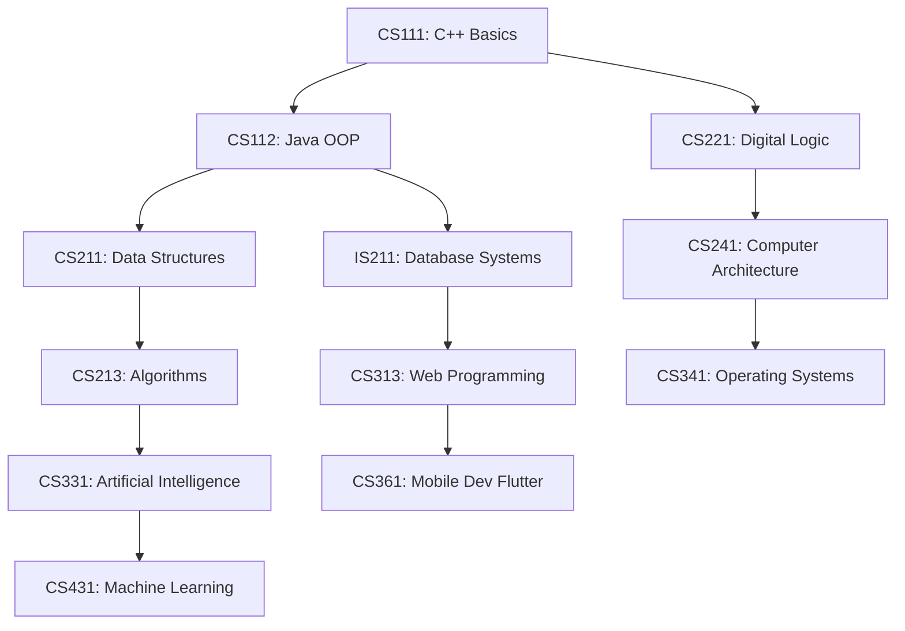

# 🗺️ 4-Year Academic Learning Roadmap

## Phase 1: Programming Mastery (Year 1)
- Master control flow, arrays, pointers, and memory management in C++.
- Transition to Object-Oriented Programming (OOP) in Java (Encapsulation, Inheritance, Polymorphism, Abstraction).
- Practice algorithmic problem solving and mathematical modeling.

## Phase 2: Data Structures & Core Systems (Year 2)
- Build dynamic arrays, linked lists, stacks, queues, trees, and hash tables from scratch.
- Analyze time/space complexity using Big-O notation.
- Master relational database design (ERD, Normalization, SQL DDL/DML/DQL).

## Phase 3: Applied Engineering & Web/Mobile (Year 3)
- Modern Web Stack: HTML5 semantic structure, CSS3 responsive layout, ES6+ JavaScript DOM manipulation.
- Python ecosystem: Object-oriented Python, file handling, data processing.
- Cross-platform Mobile App Development with Flutter and Dart.
- Systems & AI: Process scheduling, threads, IPC, and search algorithms (A*, BFS/DFS).

## Phase 4: Specialization & Graduation (Year 4)
- Machine Learning & Deep Learning foundations.
- Distributed Computing and Parallel execution.
- Capstone Graduation Project implementation.
