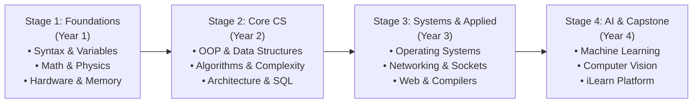

# 🧭 Academic Learning Roadmap & Skill Trajectory

This document describes the cognitive progression and engineering competencies developed across the 4-year Computer Science degree.

---

## 📈 4-Stage Competency Evolution

---

## 🎯 Key Competencies by Milestone

### 🔹 Stage 1: Computational Foundations (Semesters 1 & 2)
- **Mathematical Modeling**: Mastery of differentiation, integration, series, and electrostatic circuit analysis.
- **Structured Logic**: Fluency in primitive types, nested loops, conditional branches, and modular function decomposition in Java and C++.
- **Low-Level Grounding**: Understanding binary systems, memory addressing, logic gates, and transistor fundamentals.

### 🔹 Stage 2: Core Computer Science (Semesters 3 & 4)
- **Object-Oriented Design**: Clean encapsulation, polymorphic inheritance, and template metaprogramming.
- **Algorithmic Rigor**: Space/time complexity analysis, recurrence relations, greedy strategies, and dynamic programming.
- **Hardware/Software Interface**: MIPS processor datapath, pipeline hazard mitigation, cache organization, and digital logic synthesis.
- **Data Persistence**: Relational schema normalization (1NF through BCNF), relational algebra, and SQL optimization.

### 🔹 Stage 3: Systems Software & Scalability (Semesters 5 & 6)
- **Concurrent Networking**: Multi-client socket architecture, transport protocols (TCP/UDP), and packet inspection.
- **Kernel Concepts**: Process scheduling algorithms, virtual memory paging, synchronization primitives, and Unix system calls.
- **Full-Stack Development**: Semantic modern web interfaces, REST APIs, asynchronous programming, and event dispatching.
- **Formal Computation**: Finite automata, regular grammars, context-free parsing, and Turing computability.

### 🔹 Stage 4: Artificial Intelligence, Security & Capstone (Semesters 7 & 8)
- **Intelligent Systems**: Heuristic state-space search (A*), minimax adversarial game search, and machine learning classifiers.
- **Cryptographic Security**: Modern symmetric (AES) and asymmetric (RSA) cryptographic pipelines, hashing, and PKI security.
- **Computer Vision**: Spatial domain filters, edge detectors (Sobel, Canny), frequency-domain Fourier analysis, and image segmentation.
- **Enterprise Engineering (iLearn)**: Architecture, documentation, database design, mobile app, and web interfaces for a multi-role educational ecosystem.
