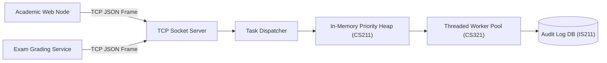

# 🌐 Cross-Course Project 1: Distributed Academic Task & Queue Service

**Integrated Disciplines:**
- `CS211` Data Structures (Priority Queues & Binary Heaps)
- `CS213` Algorithms (Complexity Optimization & Scheduling)
- `CS331` Computer Networks (Socket TCP Server & Wire Protocols)
- `IS211` Database Systems (Relational Data Persistence & Schema)
- `CSC465` Software Engineering (Layered Microservice Architecture)

---

## 📌 Problem & Overview
In high-throughput academic management systems, thousands of background tasks (such as grade recalculations, plagiarism audits, and report generation) must be scheduled, prioritized, and executed asynchronously across worker nodes without overwhelming the primary transactional database.

This project implements a concurrent, TCP-networked priority task distribution daemon that combines custom binary max-heaps with ACID persistent logging.

---

## 🏛️ Architecture

