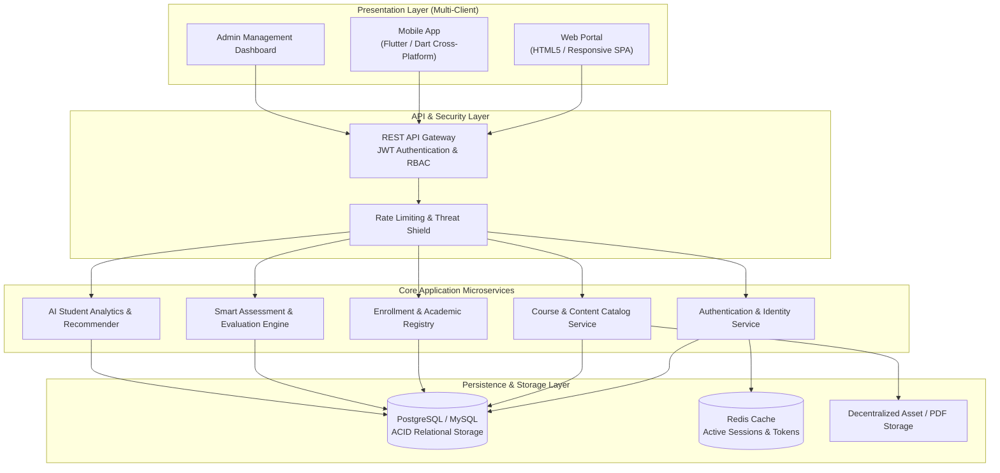
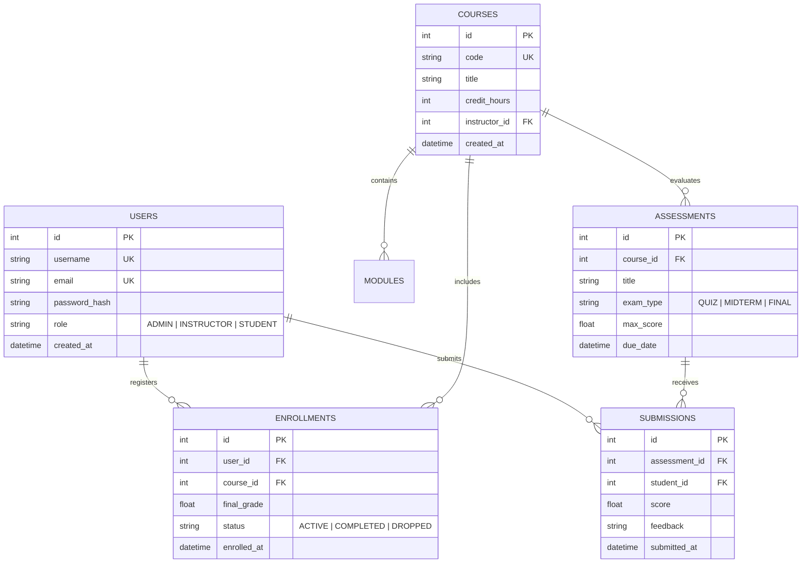

# 🎓 Capstone Project: iLearn Smart Educational Platform

**Academic Course:** `CS499` Graduation Project (6 Credit Hours)  
**Academic Year:** 4th Year (Continuous Across Semester 7 & Semester 8)  
**Author / Engineering Lead:** Ahmed Fawzy  
**Institution:** Future Academy — School of Computer Science  
**Status:** ✅ Successfully Defended with Highest Honors  

---

## 📌 Executive Overview

The **iLearn Smart Educational Platform** is a multi-tier, full-stack educational and institutional management ecosystem designed to bridge physical classrooms and virtual learning environments. Engineered during the 4th academic year, iLearn converges concepts spanning Software Engineering (`CSC465`), Relational Database Systems (`IS211`, `IS312`), Computer Networks (`CS331`), Web Development (`CS313`), Mobile Development (`CS415`), and Artificial Intelligence (`CS441`).

The system delivers:
- **Role-Based Portals**: Dedicated operational workflows for Students, Instructors, Department Chairs, and System Administrators.
- **Smart Assessment Engine**: Automated quiz generation, rubric-based automated grading, and proctoring logs.
- **Academic Analytics Dashboard**: Real-time performance tracking, course completion metrics, and AI-driven early-warning indicators for struggling students.
- **Cross-Platform Delivery**: Modern responsive Web Portal paired with high-performance Flutter mobile client applications for seamless offline-first synchronization.

---

## 🏛️ System Architecture



---

## 💡 Demonstrated Academic Disciplines

1. **Software Engineering (`CSC465`)**: Complete IEEE 830 Software Requirements Specification (SRS), Architectural Design Document (ADD), GoF Design Patterns (Factory, Repository, Singleton), and Continuous Integration test suites.
2. **Database Systems (`IS211`, `IS312`)**: Third Normal Form (3NF/BCNF) relational schema, ACID compliant transaction boundaries, foreign key integrity constraints, and query index optimization.
3. **Computer Networks & Security (`CS331`, `CS451`)**: Token-based stateless authentication (JWT), TLS/SSL transport security, bcrypt password hashing, and role-based access control (RBAC).
4. **Mobile & Web Engineering (`CS313`, `CS415`)**: Responsive CSS layouts, asynchronous fetch pipelines, Dart state management (Provider/Bloc), and RESTful client-server serialization.
5. **Applied Artificial Intelligence (`CS441`)**: Heuristic recommendation rules and statistical risk scoring for student exam readiness.

---

## 🗄️ Relational Data Model (ERD)



---

## 🚀 Running the Capstone Implementation

The core Python/FastAPI reference implementation of the iLearn service backend is located in [`src/`](./src/).

### 1. Installation
```bash
cd projects/capstone/ilearn-smart-education-platform
python -m unittest discover tests/
```

### 2. Verified Functionality
- ✅ User Registration & Secure Role Verification
- ✅ Course Catalog Creation & Prerequisite Checking
- ✅ Enrollment Engine with Grade Calculation
- ✅ Assessment Submissions & Automated Statistical Analytics
