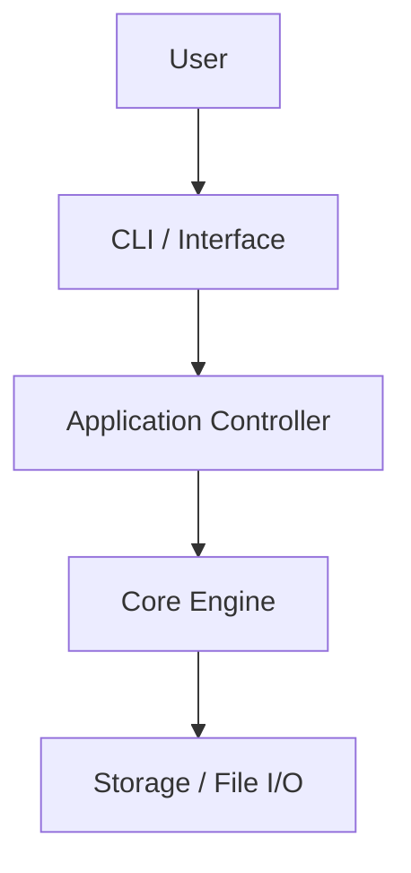

# [Project Name]

## Overview
[Executive summary of the project, its real-world context, and academic rationale.]

## Problem
[The core engineering problem being solved.]

## Goals
- [Goal 1]
- [Goal 2]

## Course Connection
- **Course:** [Code - Course Name]
- **Academic Topics:** [Mapped topics]
- **Book Chapter:** [Mapped chapters]

## Concepts Demonstrated
- [Concept 1]
- [Concept 2]

## Requirements
- **Functional Requirements:**
  1. [Req 1]
  2. [Req 2]
- **Non-Functional Requirements:**
  1. [Performance, complexity, reliability]

## Architecture


## Technology Stack
- **Language:** [Language]
- **Libraries / Tools:** [Libraries]
- **Testing:** [Testing framework]

## Project Structure
```
project/
├── README.md
├── docs/
│   ├── requirements.md
│   └── architecture.md
├── src/
├── tests/
└── data/
```

## Installation & Setup
```bash
# Setup instructions
```

## Usage & Examples
```bash
# Run command
```

## Testing
```bash
# Test execution
```

## Limitations & Future Extensions
- [Limitation 1]
- [Extension 1]

## Learning Outcomes
- [Demonstrated competency]
